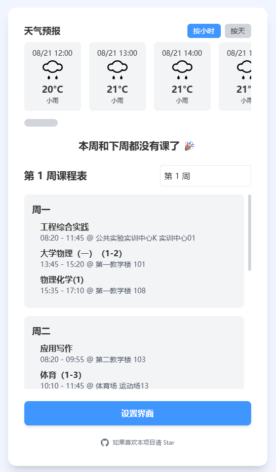
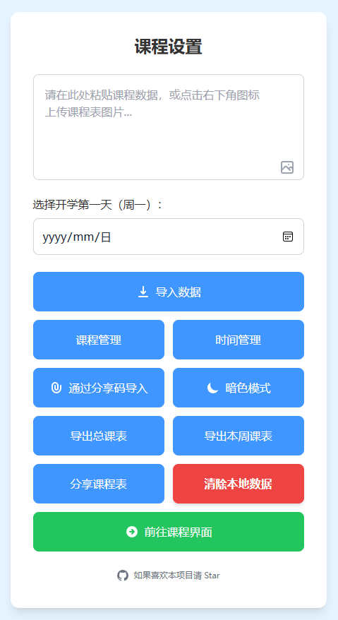
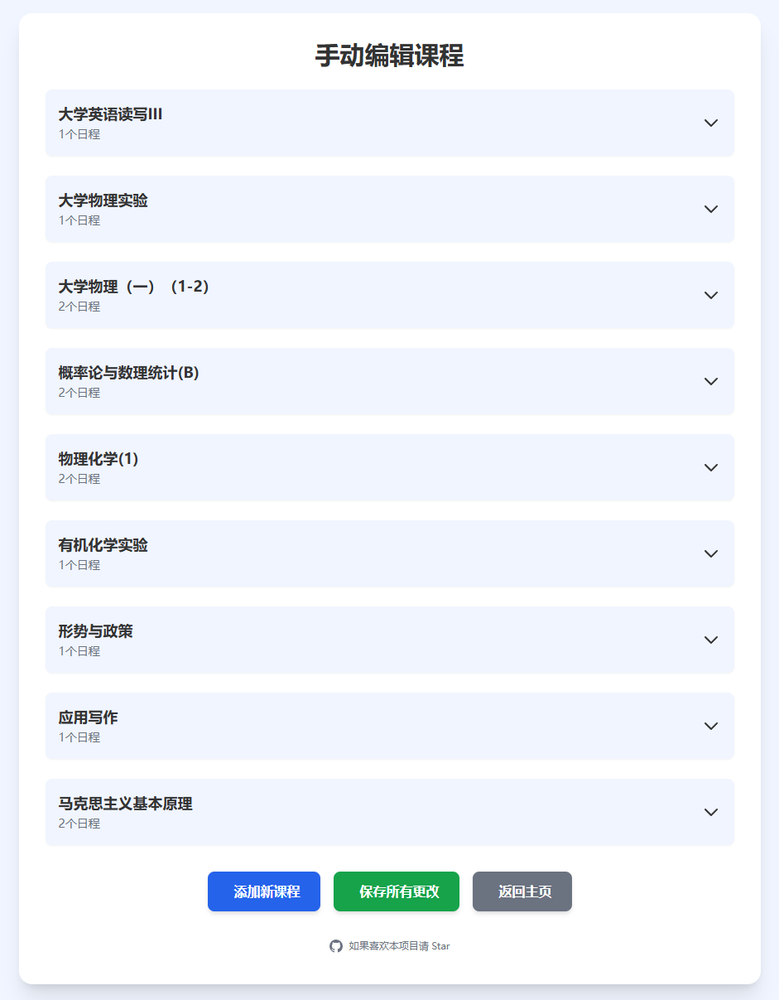
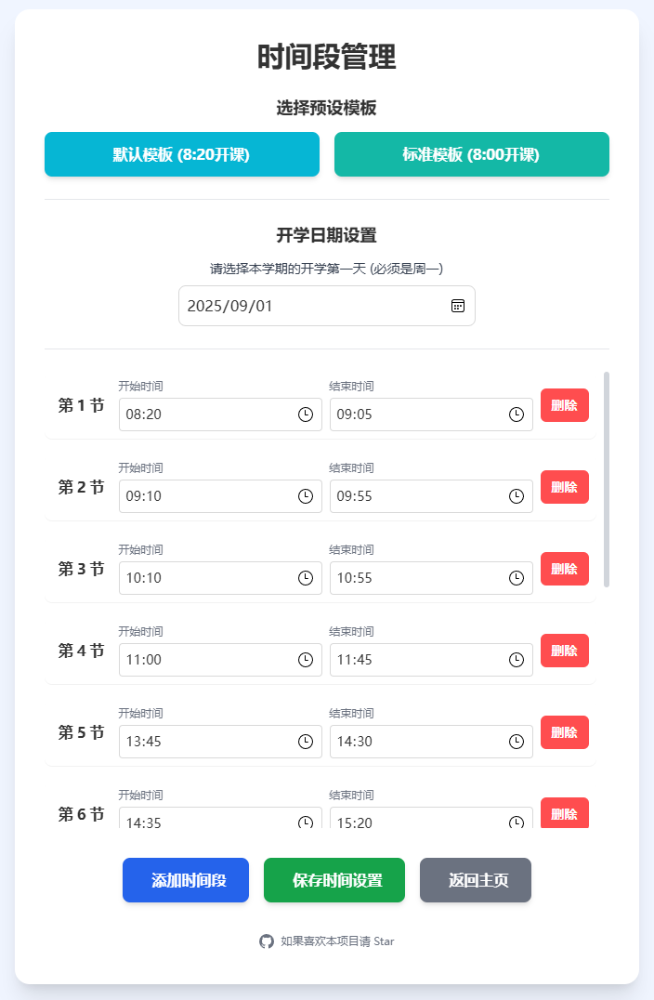
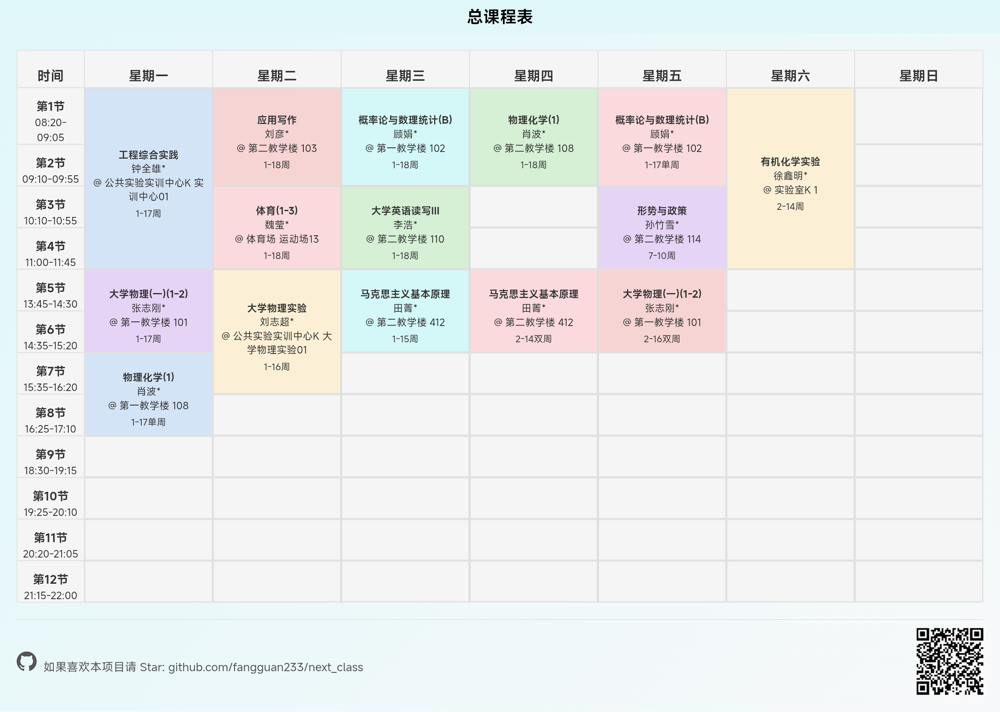
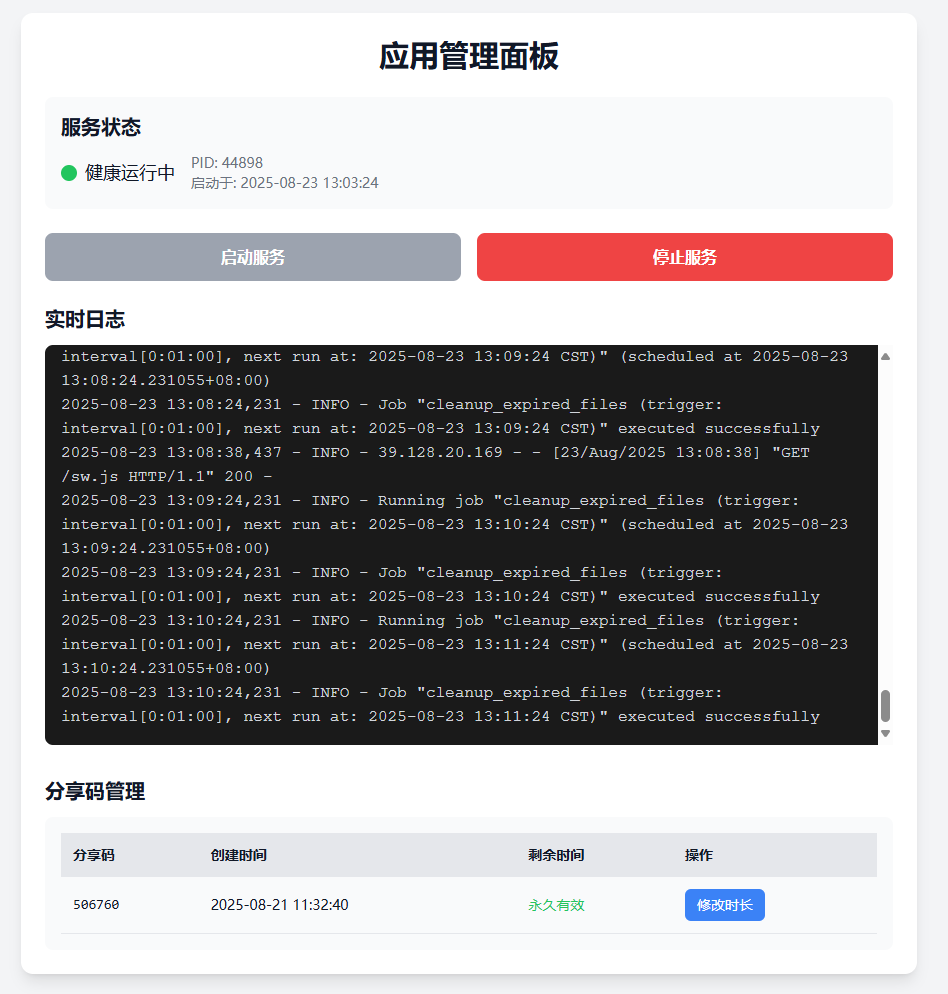

# Next_Class v1.3.3

## 项目简介

AI驱动的智能课程表，一键解析文本图片，支持离线使用和图片导出。告别手动录入，轻松管理你的大学生活！

项目目前已经发展到了稳定阶段，欢迎大家提issue和pr帮助改进。

本项目是一个基于 **Python + Flask** 后端和原生前端技术栈的现代化Web应用。它利用大语言模型（通义千问）的强大能力，智能解析非结构化课程表数据，并通过PWA技术提供离线访问和类似原生应用的体验。

项目截图：








## 技术栈

- **后端**: Python 3.9+, Flask
- **前端**: HTML, CSS, JavaScript (ES6)
- **UI框架**: Tailwind CSS (via CDN)
- **AI模型**: 通义千问 (Qwen-Coder, qvq-max-latest)
- **运行环境**: Conda (base)

## 核心功能

- **智能文本/图片解析**: 粘贴任何格式的课程表文本或上传图片，AI自动解析为结构化数据。
- **AI冲突自我修正**: 导入时自动检测并尝试修复课程冲突。
- **多视图课程表**: 支持按周切换、下拉选择周数、导出总课表/周课表为图片。
- **离线模式 (PWA)**: 在HTTPS环境下，应用核心资源可被缓存，支持离线访问。
- **下一节课速览**: 在主页清晰地展示即将到来的下一节课信息。
- **本地数据持久化**: 课程数据安全地存储在用户本地浏览器中。
- **天气预报**: 集成逐小时和按天的天气预报，并支持模式切换。
- **分享与导入**: 通过6位分享码轻松分享和导入课程表。
- **明暗模式切换**: 适应不同光线环境下的使用习惯。
- **服务化管理后台**: 提供独立的Web界面，用于监控、启停主应用、查看日志和管理分享码。
- **标准化启停脚本**: 为主应用和管理后台提供独立的启停脚本，便于在服务器上进行精细化管理。


## v1.3.3 更新日志 (2025-08-23)

本次更新聚焦于**提升开发体验和修复核心功能的稳定性**，引入了全新的PWA缓存版本控制机制，并解决了多个后台关键Bug。

### ✨ 新功能 & 优化

1.  **引入PWA缓存版本控制机制**:
    *   **功能**: 新增了 `DEV_MODE` 和 `APP_VERSION` 两个环境变量，实现了对PWA缓存更新策略的精细化控制。
        *   **开发模式 (`DEV_MODE=true`)**: 任何后端更新都会导致客户端页面**立即强制刷新**，极大提升了开发和调试效率。
        *   **生产模式 (`DEV_MODE=false`)**: 只有在 `APP_VERSION` 版本号变更时，才会触发用户页面的强制刷新，实现了对用户无感的后端Bug修复和更新。
    *   **技术实现**: 重构了 Service Worker 和客户端的通信逻辑，将更新决策权完全移交至客户端，从根本上解决了旧缓存机制导致的意外刷新问题。

### 🐛 Bug修复

1.  **修复分享码过期不删除的问题**:
    *   **问题**: 之前版本中，由于代码笔误，负责清理过期分享文件的后台定时任务从未被正确启动。
    *   **修复**: 已修正该问题，现在过期的分享码文件能够被后台定时任务**自动、可靠地**识别并删除。

2.  **修复Admin端数据损坏风险**:
    *   **问题**: 在Admin后台编辑并保存一个已有的分享文件时，会导致文件数据结构被错误地嵌套，有数据损坏的风险。
    *   **修复**: 增加了对上传数据结构的检查和修正逻辑，确保了在Admin后台反复编辑保存的安全性。

3.  **调整后台任务日志**:
    *   移除了后台清理任务在没有实际删除文件时产生的“噪音”日志，现在只在真正执行删除操作时才会记录，使日志更加清晰有效。

---

## v1.3.2 更新日志 (2025-08-20)

本次更新引入了一个功能强大的**服务化管理后台**，并对核心分享机制进行了重构，以增强系统的可维护性和稳定性。

### ✨ 新功能 & 优化

1.  **引入服务化管理后台**:
    *   **功能**: 提供一个独立的Web界面，用于**远程启停**主应用、**实时查看日志**、以及**管理所有分享码**（包括修改有效期）。
    *   **可配置**: 管理后台的运行端口可通过 `.env` 文件中的 `ADMIN_PORT` 变量进行配置。
    *   **稳定**: 修复了后台清理任务在开发模式下无法稳定运行的问题。

2.  **分享码机制重构**:
    *   分享文件的有效期现在被明确记录在文件内部，取代了旧的、依赖文件系统时间的模糊机制，使有效期管理更加精确和可靠。

---

## v1.3.1 更新日志 (2025-08-19)

增加了对icp备案的支持，修复了bug

## v1.3.0 更新日志 (2025-08-18)

本次更新聚焦于提升用户交互体验、增强核心功能以及引入离线支持，使应用更加现代化和可靠。

### ✨ 新功能 & 优化

1.  **离线模式支持 (PWA)**
    *   应用现已支持渐进式网络应用（PWA）特性。在HTTPS环境下，核心资源（HTML, CSS, JS）会被自动缓存。
    *   用户在首次访问后，即使在离线状态下也能打开和使用应用，查看已缓存的课程表数据。

2.  **课程表视图与交互升级**
    *   **UI整体修正**: 对多个界面的UI进行了微调和优化，提升了视觉一致性和用户体验。

3.  **导出功能全面增强**
    *   **集成推广信息**: 导出的课程表图片页脚处，会自动附加项目的GitHub图标、仓库地址和动态生成的页面访问二维码，便于分享和推广。

4.  **系统配置与稳定性**
    *   修复了服务器启动逻辑，现在会严格遵循 `.env` 文件中的 `ENABLE_HTTPS` 配置，解决了在开发环境中强制开启HTTPS的问题。

---

## v1.2.0 更新日志 (2025-08-16)

本次更新引入了强大的 **AI 自我修正** 核心，并围绕课程表的核心体验增加了多项实用功能，同时对系统的稳定性和交互进行了全面优化。

### ✨ 新功能 & 优化

1.  **AI 自我修正 (核心功能)**
    *   当通过图片或文本导入课程数据时，如果系统检测到课程之间存在时间冲突，后端将自动调用 AI 进行最多 **2 轮**的修正尝试。
    *   若 AI 修正失败，系统会将详细的冲突报告返回给用户，并引导至编辑页面，方便用户进行精准的手动调整。

2.  **课程表视图增强**
    *   **周视图切换**: 在课程表页面，新增了按周次向前或向后切换的功能，方便用户查看任意一周的课程安排。
    *   **课表导出为图片**: 用户现在可以将**当前周课表**或包含所有单双周信息的**总课表**导出为精美的PNG图片，便于分享和打印。

3.  **天气系统升级**
    *   在原有的逐小时天气预报基础上，新增了**按天查询**未来天气的功能。

4.  **图片导入功能 (实验性)**
    *   新增了通过上传课程表图片来自动解析和导入课程的功能。
    *   此功能可通过 `.env` 文件进行配置开启或关闭（默认为关闭），并有相应的UI提示和禁用逻辑。
    *   为了符合 AI 模型处理能力，前端对单次上传的图片数量限制为 **50** 张。

5.  **交互与视觉**
    *   为部分UI组件增加了新的**物理动效**，提升了操作的流畅度和趣味性。

6.  **系统与稳定性**
    *   通过优化开发服务器的启动配置（禁用热重载），解决了在特定环境下因依赖库频繁变动导致的服务器崩溃问题，显著提升了开发和调试的稳定性。

---

## v1.1.2 更新日志 (2025-08-14)

本次更新聚焦于**分享功能的重构和用户体验的全面优化**，旨在提供一个更安全、更便捷、更友好的课程表分享与导入流程。

### ✨ 新功能 & 优化

1.  **分享系统重构 (分享码)**
    *   **告别繁琐**：移除了原有的导出/导入JSON文件的功能。
    *   **一键分享**：现在，用户可以通过点击“分享课程表”按钮，生成一个唯一的、随机的**6位数字分享码**。
    *   **轻松导入**：其他用户只需在导入界面输入此6位分享码，即可轻松获取课程表数据。

2.  **暗色模式 (Dark Mode) 修复**
*   全面修复了在暗色模式下，弹窗中的按钮、输入框等UI元素颜色不正确、文字看不清的问题，确保了在所有光照环境下都有一致且舒适的视觉体验。

## 开发与缓存

本项目使用 Service Worker 实现了 PWA 离线缓存功能。为了平衡开发调试的便利性和生产环境的稳定性，引入了两个关键的环境变量进行控制，请在 `backend/.env` 文件中进行配置：

-   **`DEV_MODE`**: 开发者模式开关。
    -   `DEV_MODE=true`: **开发模式**。当您修改了任何前端文件（HTML, CSS, JS）并重启后端服务后，所有已打开的客户端页面**会自动强制刷新**，以确保您能立即看到最新的改动。
    -   `DEV_MODE=false`: **生产模式**。前端更新将采用更平滑的策略。只有当 `APP_VERSION` 发生变化时，才会强制刷新用户页面。如果仅是后端重启（例如修复bug），用户端将无感，不会被强制刷新。

-   **`APP_VERSION`**: 应用版本号 (例如: `"1.0.0"`)。
    -   当您在生产模式下（`DEV_MODE=false`）进行了重大的前端更新（例如UI重构、功能增加），您**必须手动提升此版本号**（例如改为 `"1.1.0"`）。
    -   只有版本号的变化才会触发生产模式下用户的强制页面刷新，确保所有用户都能更新到最新的功能。

**总结**:

-   日常开发时，请设置 `DEV_MODE=true`。
-   部署到生产环境时，请务必设置 `DEV_MODE=false`，并通过修改 `APP_VERSION` 来管理前端版本的发布。

## 部署与运行 (Linux/Conda 环境)

本项目包含两个独立的应用：主应用（用户前端）和管理后台。

### 1. 启动管理后台

执行独立的启动脚本：
```bash
sh start_admin_app.sh
```
该脚本会：
1.  激活 `conda base` 环境。
2.  进入 `backend` 目录。
3.  在后台启动管理后台 Flask 服务器（默认运行在 `5001` 端口）。

启动后，在浏览器中访问 `http://您的服务器IP:5001` 即可进入管理界面。

### 2. 停止所有服务

执行统一的停止脚本：
```bash
sh stop.sh
```
该脚本会自动读取 `backend/process_info.json` 文件，并终止主应用和管理后台的所有相关进程，然后删除状态文件。

### 3. 启用HTTPS (推荐)

为了启用 PWA 离线模式和增强安全性，强烈建议配置HTTPS。本项目支持通过 `.env` 文件和SSL证书文件一键切换。推荐使用 **ZeroSSL** 获取免费证书。

**获取证书步骤:**

1.  **注册并验证域名**:
    *   访问 [ZeroSSL.com](https://zerossl.com/) 并注册一个免费账户。
    *   进入控制台，创建一个新证书，输入您的域名或服务器IP地址。
    *   选择 “HTTP File Upload” (HTTP文件上传) 作为验证方法。ZeroSSL会提供一个验证文件（例如 `C123D456.txt`）和一串验证内容。

2.  **上传验证文件**:
    *   在项目 `backend/static/` 目录下，创建路径 `.well-known/pki-validation/`。*   将 ZeroSSL 提供的验证文件（例如 `C123D456.txt`）放入此目录，并确保文件内容与ZeroSSL提供的完全一致。

3.  **启动HTTP服务**:
    *   首先，保持 `.env` 文件中 `ENABLE_HTTPS=false`，然后执行 `sh start_server.sh` 以HTTP模式启动服务。
    *   此时，验证地址 `http://您的域名/.well-known/pki-validation/C123D456.txt` 应该可以公开访问。

4.  **完成验证并下载证书**:
    *   返回 ZeroSSL 网站，点击验证。验证成功后，下载证书文件。选择 **Nginx** 格式，您会得到一个 `.zip` 压缩包。

5.  **配置证书**:
    *   解压下载的 `.zip` 文件，您会得到三个文件。
    *   将这三个文件上传到项目的 `backend/` 目录下。

6.  **激活HTTPS模式**:
    *   编辑 `.env` 文件，将 `ENABLE_HTTPS` 的值修改为 `true`。
    *   执行 `sh stop.sh` 停止现有服务，然后执行 `sh start_server.sh` 重新启动。

服务器现在将以HTTPS模式运行。

